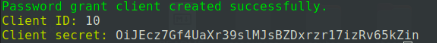
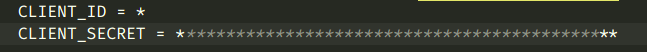
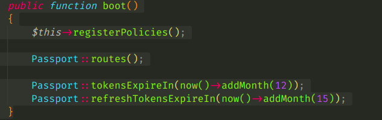

## 
 Esperlos98 packages EsAuthentication for help Authentication easy passport 

## install passport passport is required
> 
>    - composer require laravel/passport
     
 ## install EsAuthentication
>
> - composer require esperlos98/esauthentication

## migrate 
>
> - php artisan migrate

 ## publish config EsAuthentication
 >
 > php artisan vendor:publish --tag=config
    

 ## Config  esauthentication /config/esauthentication or .env add
>
>  ### run install 
>  - php artisan passport:install 
>> use Password grant client
>>  
CLIENT_ID = your clinet id

>>  CLIENT_SECRET = "your secret client code id"
>>  
> 

#### screenshot exsample
     

### clinet for passport default username is email you can  change to any 
    "client" => [
        "GRANT_TYPE" => env("GRANT_TYPE","password"),
        "GRANT_REFRESH_TOKEN" => env("GRANT_REFRESH_TOKEN","refresh_token"),
        "CLIENT_ID" => env("CLIENT_ID"), 
        "CLIENT_SECRET" => env("CLIENT_SECRET"),
        "SCOPE" => env("SCOPE",""),
        "USER_NAME"=> env("USER_NAME","email"), //here
    ],

#### screenshot exsample for env

### app\Providers\AuthServiceProvider add boot method 
    use Laravel\Passport\Passport;

    Passport::routes();

    Passport::tokensExpireIn(now()->addMonth(12));
    Passport::refreshTokensExpireIn(now()->addMonth(15));

#### screenshot

### add file user model /app/Models/User.php

###  
note for laravel 9
 

> remove use Laravel\Sanctum\HasApiTokens;

    use Laravel\Passport\HasApiTokens;
    use HasApiTokens;

### add api drive  config/auth.php array guards and use middleware auth:api
    guards[

        'api' => [
            'driver' => 'passport',
            'provider' => 'users',
        ],
    ]

### rules   
    "rules" => [
        "Register" => [
            'name' => 'required',
            'email' => 'required|email|unique:users',
            'password' => 'required|confirmed|min:8'
        ],
        "Login" => [
            'email' => 'required|email',
            'password' => 'required',
        ],
    ],
### massages    
    "massages" => [
        "required" => 601,
        "confirmed" => 602,
        "min" => 603,
        "email" => 604,
        "unique" => 605
    ],
### user register fileds     
    "userFileds" => [
        "name" => "name",
        "email" => "email",
        "password" => "password",
    ],

## Routings
> ### for login 
> 
yourdomine/api/es/v1/login

> 
parameters : email ,password
 

> ### for register  
> 
youerdomine/api/es/v1/register

> 
parameters : email , name , password , password_confirmation

> ### for refresh token  
> 
youerdomine/api/es/v1/refreshToken

> 
 parameter : refresh_token 

